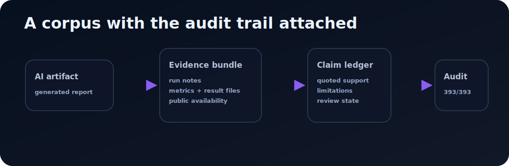

# Enoch AI Research Corpus



**A public corpus of AI-generated research artifacts with the audit trail attached.** Each artifact is released with provenance metadata, evidence bundles, claim ledgers, and public quality reports so readers can inspect what the generated report is — and is not — allowed to claim.

<p>
  <a href="papers/index.md"><strong>Browse artifacts</strong></a> ·
  <a href="quality/claim_evidence_audit.md"><strong>Strict audit</strong></a> ·
  <a href="docs/reproducibility.md"><strong>Reproducibility notes</strong></a> ·
  <a href="https://solo-09d10f60.mintlify.app/"><strong>Enoch Docs</strong></a>
</p>

## Current public status

| Gate | Status | Meaning |
| --- | ---: | --- |
| Indexed artifacts | `393` | AI-generated reports in the public corpus |
| Packaging/provenance lint | `393/393` | Release hygiene, provenance metadata, evidence/ledger presence, placeholder/secret checks |
| Strict claim/evidence audit | `393/393` | Generated claims trace to public result files or explicit public unavailability metadata |
| Empty claim ledgers | `0` | No artifact is missing claim-ledger accounting |
| Missing public result-file refs | `0` | Public audit found no missing public result-file references |

These are auditability and packaging facts. They do **not** mean the generated results are peer reviewed, independently replicated, or scientifically correct.

## What this is

This corpus contains:

- generated report text (`paper.md`);
- public provenance metadata (`metadata.json`);
- evidence bundles and public result-file references;
- claim ledgers with quoted support, limitations, and review state;
- packaging/provenance and strict claim/evidence audit reports.

Start with [`papers/index.md`](papers/index.md) for the artifact list, [`quality/packaging_provenance_report.md`](quality/packaging_provenance_report.md) for release-hygiene status, and [`quality/claim_evidence_audit.md`](quality/claim_evidence_audit.md) for strict claim/evidence traceability.

## What this is not

This is not a collection of human-authored academic papers, peer-reviewed publications, or accepted scientific claims. The maintainer/operator releases the corpus for inspection, replication, and critique but does not claim personal authorship of the generated papers, arguments, or prose.

> These reports were generated by an autonomous AI research pipeline from automated research artifacts. The human maintainer operated and developed the surrounding software infrastructure and releases the corpus transparently, but does not claim personal authorship of the individual papers or scientific claims.

## Repository layout

```text
papers/
  index.json
  index.md
  <paper-slug>/
    paper.md
    metadata.json
    evidence_bundle.json
    claim_ledger.json
quality/
  packaging_provenance_report.json/.md
  claim_evidence_audit.json/.md
  quality_report.json/.md        # compatibility copy
```

## Related Enoch surfaces

- System/control plane: <https://github.com/alias8818/enoch-agentic-research-system>
- Promising no-paper signals: <https://github.com/alias8818/enoch-promising-signals>
- Hosted docs: <https://solo-09d10f60.mintlify.app/>
- Hugging Face dataset: <https://huggingface.co/datasets/aliasocracy/enoch-ai-research-corpus>

## License

Released under CC0 1.0 Universal. See [`LICENSE.md`](LICENSE.md).
